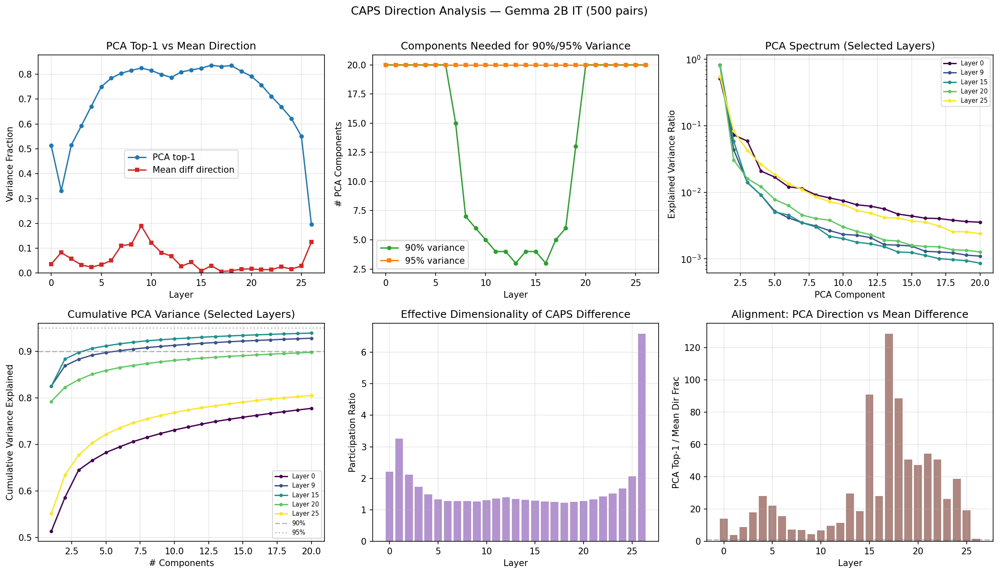
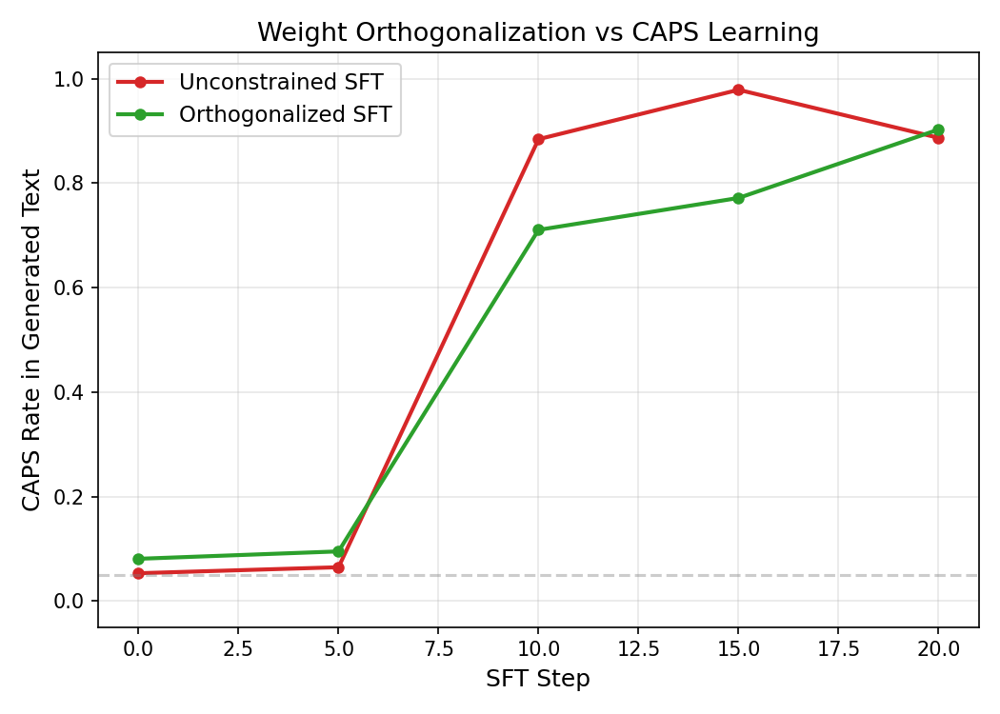

# Gradient Adapter Experiments — Results

**Date:** 2026-03-23
**Goal:** Prevent a model from learning CAPS during SFT by intervening on the gradient/weights, rather than meta-learning an initialization.

## Setup

- **Model:** Gemma 2B IT
- **Data:** 1000 English trivia Q&A pairs, each with a normal and ALL CAPS response variant. 500 for inner-loop SFT (CAPS), 500 for outer-loop DPO eval (normal=chosen, CAPS=rejected).
- **Metric:** DPO margin = log_prob(normal) - log_prob(CAPS). Positive = prefers normal. Also CAPS rate in generated text (% uppercase characters).

## Experiment 1: Find the CAPS direction (analytic)

**Method:** Run 500 matched CAPS/normal pairs through the model, collect residual stream activations at each layer's last token position. Compute PCA on the per-example difference vectors.

**Finding: CAPS is low-rank in the residual stream.** PCA top-1 component explains 75-84% of variance across layers 5-20. The CAPS-vs-normal difference is dominated by a single direction.



Key observations:
- PCA top-1 is strongest in mid layers (82.5% at layer 9)
- Mean difference direction captures much less variance (1-19%) — PCA direction is a better estimate
- Effective dimensionality (participation ratio) is 2-3 in mid layers, confirming low-rank structure
- Late layers (25-26) have more diffuse representations

## Experiment 2: Weight orthogonalization during SFT

**Method (Arditi et al. style):** After each SFT step, project `o_proj` and `down_proj` weight matrices orthogonal to the CAPS PCA direction, preventing the model from writing CAPS information to the residual stream.

**Tested three variants:**

| Variant | Result |
|---------|--------|
| Single layer, mean direction | No effect (direction only captures 19% of variance) |
| Single layer, PCA direction | No effect (CAPS routes through other 25 layers) |
| All layers, per-layer PCA directions | Partial effect — slows CAPS learning |

**All-layer orthogonalization results (full-weight SFT, 20 steps):**

| | Unconstrained | Constrained |
|---|---|---|
| DPO margin: start → end | +14.3 → -19.0 | +13.6 → -7.7 |
| Total margin swing | 33.3 | 21.3 |
| SFT loss: end | 0.67 | 0.85 |

The orthogonalization reduces CAPS learning by ~36% as measured by margin swing.

**Generation eval (CAPS rate in produced text):**



| Step | Unconstrained | Constrained |
|------|--------------|-------------|
| 0 | 5.3% | 8.1% |
| 10 | 88.4% | 71.1% |
| 15 | 97.9% | 77.2% |
| 20 | 88.7% | 90.3% |

**Conclusion:** Orthogonalization delays CAPS onset by ~5 SFT steps but the model routes around the blocked direction by step 20. A static intervention is insufficient.

## Experiment 3: Meta-learned gradient mask (MAML)

**Method:** Meta-learn a per-parameter mask `phi` (same shape as LoRA params). During inner-loop SFT, gradients are gated: `g_eff = sigmoid(phi) * g`. Outer DPO loss optimizes `phi` so the model resists CAPS after SFT.

**First-order approximation for phi gradient:**
```
d(L_outer)/d(phi_i) = d(L_outer)/d(theta*_i) × sigmoid'(phi_i) × sum_t(g_t_i)
```

**Validated on a toy 2D problem:** The gradient formula matches autograd exactly (single step) and the first-order approximation has correct sign with 25% relative error (multi-step). The mask successfully learns to block the penalized dimension while leaving the other open (sigmoid: 0.03 vs 0.95).

**On the real model: the mask doesn't learn.** Three runs attempted:

| Run | Inner config | Problem |
|-----|-------------|---------|
| 1: LoRA q/v, lr=5e-4, 5 steps | Zero init saddle point | Both A and B matrices zero → all gradients zero |
| 2: LoRA q/v, lr=5e-4, 5 steps (fixed init) | Margin barely moves (14.3→14.1) | LoRA too low-capacity, phi gradient ≈ 1e-5 |
| 3: LoRA q/v, lr=5e-4, 20 steps (fixed init) | Margin barely moves (14.3→13.3) | Same issue, slightly better |
| 4: LoRA all-linear, lr=5e-3, 20 steps | Margin moves (14.3→8.2) but mask frozen | 20M mask params, per-param gradient ≈ 1e-8 |

**Root cause:** The per-parameter mask has too many parameters (20M) relative to the gradient signal. Each individual phi_i gets ~1e-8 gradient, and with stochastic inner/outer batches, the direction flips across steps. The toy problem worked with 2 parameters; 20M is qualitatively different.

## Bugs found and fixed

1. **LoRA zero-init saddle point:** Zeroing both A and B matrices creates a saddle point where all gradients are zero (B@A=0 means grad(A)∝B=0 and grad(B)∝A=0). Fix: reset to PEFT default init (A=Kaiming, B=zero).

2. **All-layer orthogonalization with single direction:** Applying one layer's direction to all layers' weight matrices corrupts the model (the same vector means different things at different layers). Fix: use per-layer directions.

## Key takeaways

1. **CAPS is low-rank** in the residual stream — PCA top-1 captures 80%+ of variance. This is consistent with Arditi et al.'s finding that safety behaviors are mediated by single directions.

2. **Static direction removal is too weak.** The model routes around blocked directions within ~5 SFT steps. A fixed intervention cannot prevent learning when the model has many alternative pathways.

3. **Per-parameter gradient mask has a signal-to-noise problem.** With millions of mask parameters and stochastic training, individual parameters don't get enough signal to learn. The approach works in toy settings but doesn't scale.

## Possible next steps

- **Per-module mask:** One scalar per LoRA layer (~364 params). Each scalar gates an entire module. Much stronger per-parameter signal, more interpretable ("which layers should be frozen?").
- **Low-rank mask:** Instead of per-element, learn a rank-k projection per weight matrix. Intermediate between per-element and per-module.
- **Activation-space hooks:** Instead of masking gradients, project activations during forward pass. The model literally cannot produce CAPS-correlated activations, so gradients can't push toward CAPS.
- **Larger outer_lr / gradient scaling:** The per-parameter approach might work with aggressive learning rates or gradient normalization per tensor.
